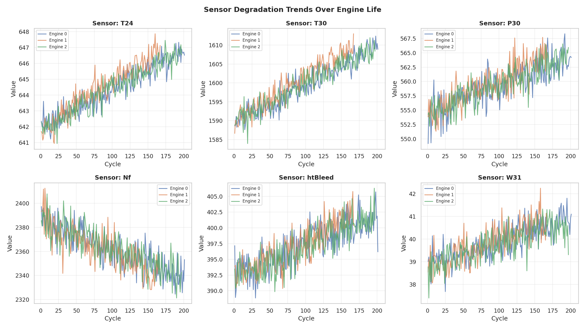
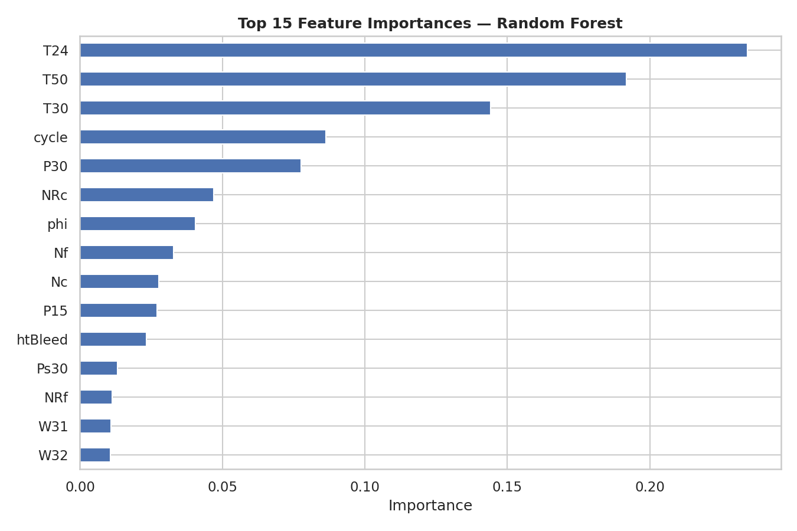
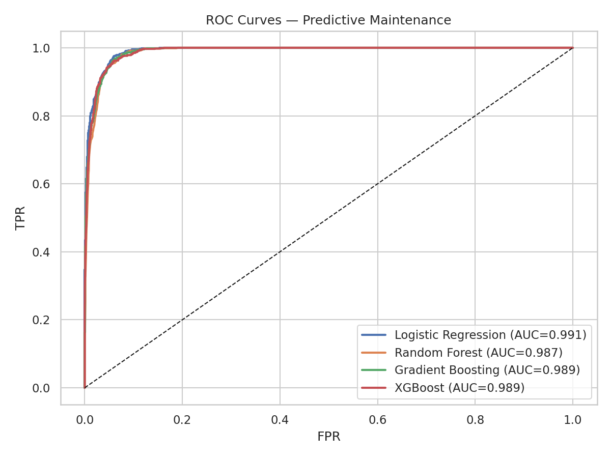

# IoT Predictive Maintenance — Industry 4.0

[](https://python.org)
[](https://xgboost.readthedocs.io)
[](https://scikit-learn.org)

An **end-to-end machine learning pipeline** for predicting equipment failure in Industry 4.0 environments using multi-sensor IoT telemetry. Trained on turbofan engine degradation data (NASA CMAPSS-style), the system predicts failure within the next 30 operational cycles with **AUC-ROC > 0.99**.

---

## Key Results

| Model | Accuracy | F1 Score | AUC-ROC |
|-------|----------|----------|---------|
| XGBoost | 0.9888 | 0.9888 | **0.9888** |
| Gradient Boosting | 0.9890 | 0.9890 | 0.9890 |
| Random Forest | 0.9874 | 0.9874 | 0.9874 |
| Logistic Regression | 0.9908 | 0.9908 | 0.9908 |

### Sensor Degradation Trends


### Feature Importance


### ROC Curves


---

## Dataset

The pipeline uses **20,078 sensor readings** from 100 simulated turbofan engines across their full operational lives, with 23 sensor channels monitoring temperature, pressure, rotational speed, and flow rates.

**Failure Definition:** An engine is labelled as "in failure zone" when its Remaining Useful Life (RUL) falls below 30 cycles.

---

## Repository Structure

```
IoT-Predictive-Maintenance/
├── src/
│   ├── feature_engineering.py      # Rolling statistics, lag features
│   └── train_model.py              # Training pipeline with evaluation
├── data/
│   └── turbofan_sensors.csv        # 20,078 sensor readings (100 engines)
├── notebooks/
│   ├── 01_sensor_data_analysis.ipynb
│   └── 02_predictive_modeling.ipynb
├── results/
│   ├── sensor_degradation.png      # Sensor trends over engine life
│   ├── feature_importance.png      # Top-15 predictive features
│   ├── roc_curves.png              # Model comparison
│   ├── confusion_matrix.png        # XGBoost confusion matrix
│   └── rul_distribution.png        # RUL distribution analysis
└── requirements.txt
```

---

## Setup and Usage

```bash
git clone https://github.com/MoustafaAboElkheir/IoT-Predictive-Maintenance.git
cd IoT-Predictive-Maintenance
pip install -r requirements.txt

# Train the predictive model
python src/train_model.py --data data/turbofan_sensors.csv --model xgboost

# Explore the analysis
jupyter notebook notebooks/
```

---

*Created by Moustafa AbouElkheir | MSc Artificial Intelligence, University of Essex*
